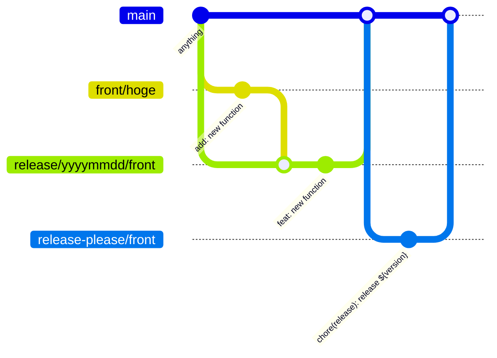

# test-rp
release please の動作確認を行うリポジトリ

## RP Base format
```
<type>[optional scope]: <description>

[optional body]

[optional footer(s)]
```

## 概要

タイプ (\<type\>)|説明|活用方法
---|---|---
feat|新機能の追加|Semantic Versioning (SemVer) の MINOR バージョンアップ（例: 1.2.0 -> 1.3.0）をトリガーするために使用されます
fix|本番コードのバグ修正|SemVer の PATCH バージョンアップ（例: 1.2.0 -> 1.2.1）をトリガーするために使用されます
chore|ビルドプロセス、補助ツール、ドキュメント生成など、リポジトリの運用に関する変更|バージョンアップをトリガーません
docs|ドキュメントのみの変更（コードの変更なし）|バージョンアップをトリガーしません
style|コードの整形（スペース、セミコロンなど）。ロジックの変更なし。デザインの変更|バージョンアップをトリガーしません→ PATCHバージョンの変更にする
refactor|バグ修正も新機能でもない、コードのリファクタリング|バージョンアップをトリガーしないことが一般的です
test|テストの追加や修正|バージョンアップをトリガーしません

## バージョンへのアプローチ

アプローチ|コミット例|結果のバージョンアップ (SemVer)
---|---|---
PATCH|fix: ユーザーのログインバグを修正|1.2.3 → 1.2.4
MINOR|feat: ユーザー管理画面を追加|1.2.3 → 1.3.0
MAJOR|feat: APIの認証方式をOAuth2に変更<br>BREAKING CHANGE: 旧APIは廃止|1.2.3 → 2.0.0

## scope, body, footer の活用方法
### optional scope
スコープは、括弧 () で囲まれた部分で、
その変更がリポジトリ内の特定のサブシステム、パッケージ、またはコンポーネントに限定されることを示します。

- fix(parser): 入力文字のエンコーディング問題を修正
- feat(api): ユーザー検索エンドポイントを追加
- refactor(db): データベース接続ロジックをリファクタリング

### optional body
ボディは、コミットメッセージの2行目以降に記述する詳細な説明文です。

```
feat: 新しいユーザー登録フォームを実装

この変更は、古い登録プロセスが GDPR/CCPA に準拠していないというユーザーフィードバックに対応するためです。
フォームの検証ロジックを分離し、カスタムフックを使用して再利用性を高めました
```

### optional footer
フッターは、コミットメッセージの末尾に記述するメタデータで、特に破壊的変更 (Breaking Change) の宣言や、関連するイシュー/タスクへの参照に使用されます。フッターは、キーと値のペアで構成されます。

#### 例1：破壊的変更 (MAJORバージョンアップ) 破壊的変更を示すために、フッターに BREAKING CHANGE: または BREAKING-CHANGE: のトークンを記述します。

```
feat: ユーザー認証に 2FA を導入

... (ボディ省略)

BREAKING CHANGE: 認証 API のエンドポイントが /auth/v1 から /auth/v2 に変更されました。
旧バージョンを使用しているクライアントはアップデートが必要です
```

#### 例2：イシュー参照 GitHubなどのトラッキングシステムでイシュー（課題）を閉じるために使用されます。
```
fix(ui): モーダルウィンドウの z-index を修正

この修正により、特定の条件下でモーダルが他の要素の下に隠れる問題を解決しました。
```

## ブランチ運用について

- トランクブランチを利用する：現行の管理通り本番デプロイが main or masterブランチ のリソースであること
- ブランチ名：自由
- コミットコメント：開発時は自由、トランクブランチへプッシュするときの最終コミットコメントに CC を活用する

### イメージとブランチ管理説明


- `main` (トランクブランチ：必ず本番環境で動いているコード)
- `front/hoge` ( front用開発ブランチ )
    - Commit: "add: new function" ※ CCでなくて問題ない
    - Merge: squash and merge
- `release/yyyymmdd/front` ( 上記ブランチのリリースブランチ )
    - Commit: "feat: new function"
    - Merge: squash and merge ※ このときコミットコメントを編集する最終画面で CC に編集

- `release-please/front` ( RPが自動生成するブランチ )
    - Commit: "chore(release): release ${version}" ※自動生成

## 自動生成されるブランチ名の制御
### 制御方法
ルートディレクトリに release-please-config.json を生成する

#### 例：app に external と internal がある場合、下記のように release-please.json に定義する
``` json
{
  "packages": {
    "src/app-external": {
      "component": "app-external", // component名を設定
      "release-type": "node"
    },
    "src/app-internal": {
      "component": "app-internal",
      "release-type": "node"
    }
  }
}
```

生成されるブランチ名は下記のようになる
- release-please/app-external/1.0.0
- release-please/app-internal/2.3.0
※ 最後は適用されるバージョン値
